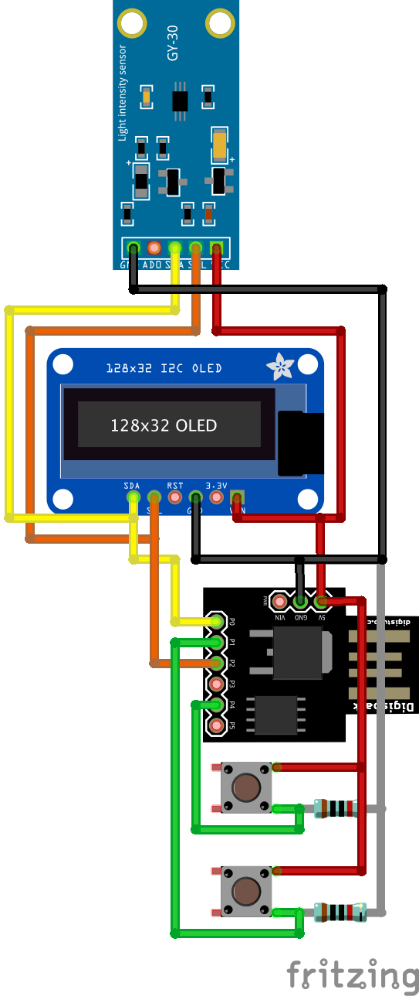

# Luxímetro com Digispark Attiny85 e Sensor Gy-30

Este é um exemplo de como usar e configurar o sensor de luminosidade Gy-30 com o microcontrolador Digispark Attiny85.

## Funcionalidades
* Botão para troca de precisão do modo de leitura
* Botão para travar a leitura

## Sensor Gy-30

O sensor Gy-30 é um sensor de luminosidade que utiliza um fotodiodo para detectar a luz ambiente e converte essa luz em uma tensão elétrica. A saída do sensor é proporcional à quantidade de luz que ele detecta. Ele pode ser utilizado em diversas aplicações, como sistemas de iluminação automática e controle de brilho de tela.

O sensor Gy-30 possui uma eficiência superior à do olho humano na medição de luz visível, mas pode apresentar algumas limitações em relação à detecção de luz infravermelha e ultravioleta.

## Instruções de utilização

Para utilizar este projeto, siga os passos abaixo:

### Materiais necessários

- Digispark Attiny85
- Sensor de luminosidade Gy-30
- Cabos jumper
- Computador com Arduino IDE instalado

### Instalação das bibliotecas

Para utilizar o sensor Gy-30, é necessário instalar a biblioteca correspondente no Arduino IDE. Siga os passos abaixo:

1. Abra o Arduino IDE.
2. No menu `Sketch`, selecione `Incluir Biblioteca` > `Gerenciar Bibliotecas`.
3. Na caixa de pesquisa, digite `GY-30`.
4. Clique no botão `Instalar` para instalar a biblioteca `GY-30`.

Para utilizar o Digispark Attiny85 no Arduino IDE, é necessário instalar a placa correspondente. Siga os passos abaixo:

1. Abra o Arduino IDE.
2. No menu `Arquivo`, selecione `Preferências`.
3. Na caixa de texto `URLs Adicionais de Gerenciamento de Placas`, adicione a seguinte URL: `http://digistump.com/package_digistump_index.json`
4. Clique no botão `OK`.
5. No menu `Ferramentas`, selecione `Placa` > `Placas de Desenvolvimento Digistump AVR`.
6. Selecione `Digispark (Default - 16.5mhz)`.

### Execução do projeto

1. Abra o arquivo `luximetro.ino` no Arduino IDE.
2. Conecte o Digispark Attiny85 ao computador.
3. No menu `Ferramentas`, selecione a porta correspondente ao Digispark Attiny85.
4. Clique no botão `Carregar` para enviar o código para o microcontrolador.
5. Abra o `Monitor Serial` do Arduino IDE para visualizar as leituras do sensor de luminosidade.

### Conexões

Conecte o sensor Gy-30 ao Digispark Attiny85 seguindo o diagrama abaixo:

## Referências

- Datasheet do sensor Gy-30: http://www.e-gizmo.com/KIT/images/GY-30light.pdf
- Biblioteca do sensor Gy-30: https://github.com/Seeed-Studio/GY30
- Instruções de instalação do Digispark Attiny85 no Arduino IDE: http
