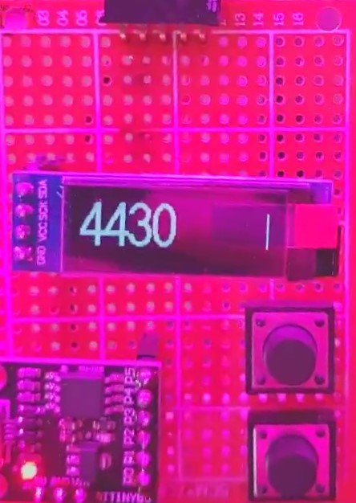

# Luximetro Digispark Attiny85
Luximetro digital feito com Attiny85, Sensor de luminosidade GY30 e Display OLED 0.91".

### Funcionalidades
* Botão para troca de precisão do modo de leitura
* Botão para travar a leitura

